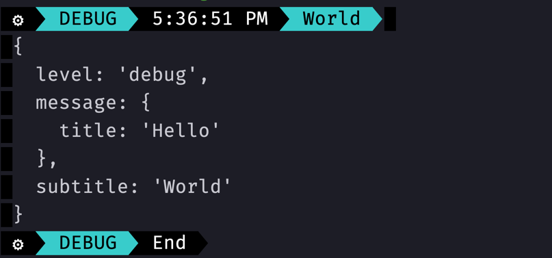
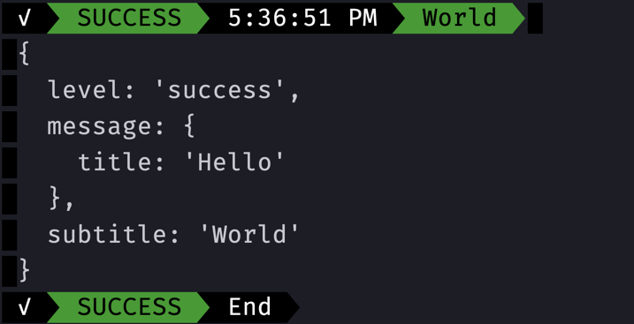

# Terminal string & JSON styler with full color
## Be bold, Be Right, Be Colorful

## Usage
### Bullet train style logger
```typescript jsx
import { logger, getLogger } from "colorful-log-message";

const messageColorful = getLogger(logger, "bullet-train");

console.log(
  messageColorful({
    level: "debug",
    message: {
      title: "Hello",
    },
    subtitle: "World",
  }),
);
```


 **success**

```typescript jsx
console.log(
  messageColorful({
    level: "success",
    message: {
      title: "Hello",
    },
    subtitle: "World",
  }),
);
```

